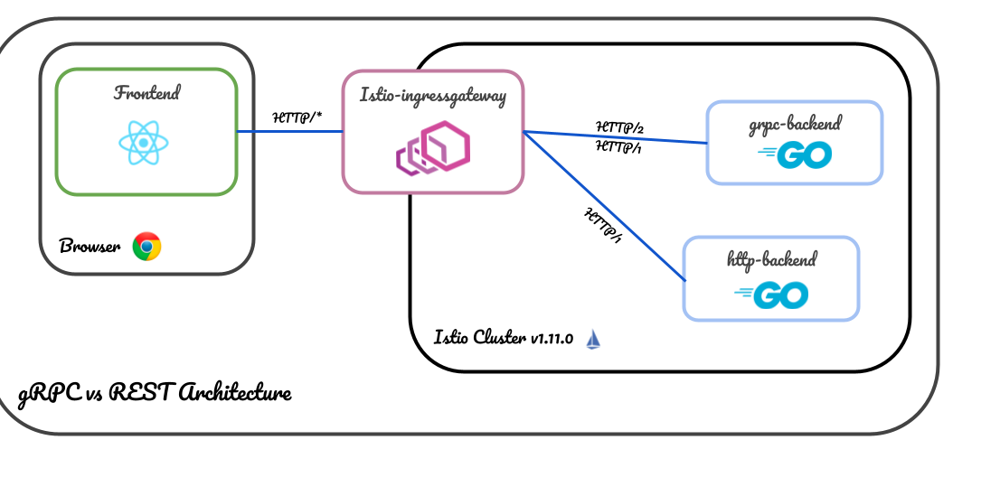

# grpc-vs-rest

* [Contributing](#contributing)
* [Project Overview](#project-overview)
  * [Architecture](#architecture)
* [Code Base](#code-base)
* [Prerequisites](#prerequisites)
* [Local Development](#local-development)
* [Pipeline](#pipeline)

[Live](https://freshlist.us)
## Contributing
Anyone can contribute to this project, read the [CONTRIBUTING.md](docs/CONTRIBUTING.md) to get started.
   


## Project Overview
_This project contains a front and backend that run in Istio. The frontend requests data from the backend through REST and gRPC to show the differences in efficiency and load time to the end user. It is for education purposes in nature. The frontend is a react app that uses gRPC web and axios. The backend is a golang application that exposes a gRPC port and a REST port._

### Architecture


### Code Base
_This section is meant to give an overview of the repository structure and how to navigate our code base._

The repository is split up into:
- docs - GitHib pages docs site
- frontend - Frontend of the application, react app
- backend - backend of the application, golang
- charts - Helm charts for deploying the application
- .github/workflows - Pipeline manifests for testing the application and deploying into production

### Prerequisites
_The following assets are required locally to run this application._

- Node v14
- Go 1.16
- mongo 5.0.2

### Local Development
_This section details how to setup the environment locally for development._

Clone the repo
```
git clone https://github.com/cmwylie19/grpc-vs-rest
```

Run the react-app
```
cd frontend;

# install dependencies
yarn

# run the frontend
REACT_APP_BACKEND_URL=http://localhost:8080 yarn start 
```
Start MongoDB
```
brew services start mongodb-community

# or

docker run -d -p 27017-27019:27017-27019 --name mongodb mongo:5.0.2
```
Run the backend
```
# change to the backend directory grpc-vs-rest/backend
cd backend

# Install dependencies
go mod tidy

# Run the backend
go run main.go
```

### Pipeline
The pipeline consists of multiple jobs. The expectation is the the code pushed into the pipeline will be tested and errors will be detected before going to prod. It is extremely important to test code locally before pushing code into the pipeline to make sure all tests are passing and that any new features are well tested. Pll Requests will not be accepted if they fail the pipeline.


  # - match:
  #   - uri:
  #       prefix: /com.example.grpc.EchoService/
  #   route:
  #   - destination:
  #       host: echo-server

# https://medium.com/swlh/building-a-realtime-dashboard-with-reactjs-go-grpc-and-envoy-7be155dfabfb