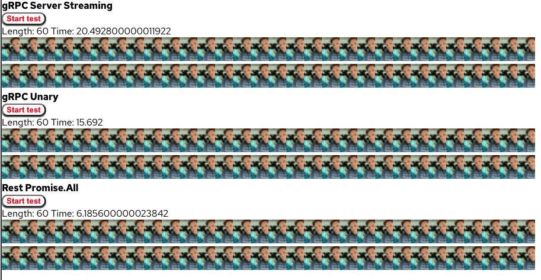

## gRPC vs Rest
This is a simple application that requests an image from two distinc backends with two distinct databases. 
You can view the site [live](https://freshlist.us) to view the code running in production.

**Screenshot**



At this moment, the project is very young, and not finished. The production site will be changing rapidly as development ensues.

### Architecture
The application is running in Istio. We are using the envoy proxy to translate the gRPC streaming request to the frontend. `VirtualService` configuration will be seen at `vs-default.yaml` in the root folder. The `VirtualService` contains a frontend, an http-backend, and a catch all grpc-backend.


### VirtualService
The VirtualService responsible for translating gRPC streams to the frontend can be seen below. The frontend is a react app, the two backends are go apps (image and rest-image).

**default virtual service**
```
apiVersion: networking.istio.io/v1beta1
kind: VirtualService
metadata:
  name: default
  namespace: default
spec:
  hosts:
  - "*"
  gateways:
  - gateway
  http:
  - match:
    - uri:
        exact: /
    - uri:
        exact: /favicon.ico
    - uri:
        exact: /manifest.json
    - uri:
        exact: /logo192.png
    - uri:
        prefix: /static
    - uri:
        prefix: /sockjs-node
    route:
    - destination:
        host: frontend
        port:
          number: 80
        subset: v1
  - match:
    - uri:
        prefix: /rest
    route:
    - destination:
        host: rest-image
        port:
          number: 8080
        subset: v1
  - route:
    - destination:
        host: image
        port:
          number: 8081
        subset: v1
    timeout: 120s
    retries:
      attempts: 3
      perTryTimeout: 40s
    corsPolicy:
      allowOrigin:
        - "*"
      allowMethods:
        - POST
        - GET
        - OPTIONS
        - PUT
        - DELETE
      allowHeaders:
        - grpc-timeout
        - content-type
        - keep-alive
        - user-agent
        - cache-control
        - content-type
        - content-transfer-encoding
        - custom-header-1
        - x-accept-content-transfer-encoding
        - x-accept-response-streaming
        - x-grpc-web
      maxAge: 1728s
      exposeHeaders:
        - custom-header-1
        - grpc-status
        - grpc-message
```
### Contributors

This project was created for Hacktoberfest. Huge thank you to all who have contributed to this project!

Names:


### Support or Contact

Having trouble with this application? Check out the [README.md](https://github.com/cmwylie19/grpc-vs-rest/blob/main/README.md) or file an [issue](https://github.com/cmwylie19/grpc-vs-rest/issues), or [email me](mailto:casewylie@gmail.com?subject=grpcvsrest hacktoberfest) and we’ll help you sort it out.
